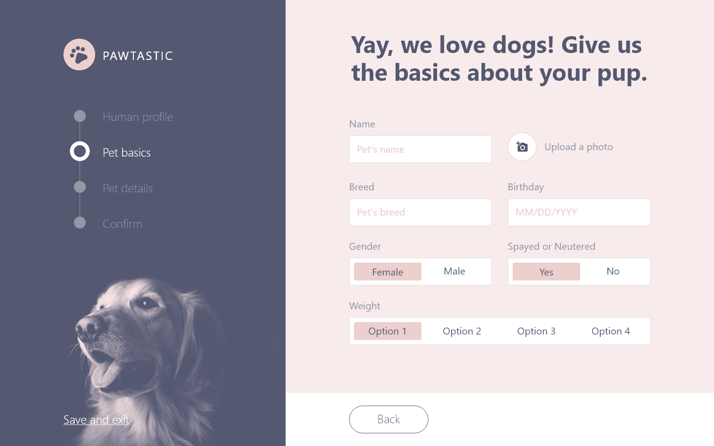

# pawtastic_form
# 
# Homework: W2D5: Form and User Input
##### Mockup of a Pawtastic web page
# 
# Wireframe

##### Wirframe Source credits:  Behance "Pawtastic UI Kit for Adobe XD"
##### Link: https://www.behance.net/gallery/62932019/Pawtastic-UI-Kit-for-Adobe-XD 
# 
#### Features: 
##### Left pane layout: Flexbox
#####    Navbar activation: mouseover
##### Right pane layout: Grid & Flexbox
#####    Misc: Form button toggles, date input, file select, data recorded alert 